# Using Azure DevOps to build and deploy your application to Azure Kubernetes Service

In this article I will describe how to use azure pipeline to:
* build a docker image of your application
* push this image to to Azure Container Register
* create and release your kubernetes deployment to Azure Kubernetes Service

If you don't have a a basic knowlage about docker, kubernetes and Azure CLI please check my previous article [here](https://softwarehut.com/blog/tech/deploying-net-core-application-to-azure-kubernetes-cluster).

## Azure DevOps
Azure DevOps can automate your Continous Integration and Deployment process.
It can get access to you git repository (Azure Repos Git, GitHub and other git repositories).
It can automaticly react on what you are doing with your repository: 
* run build and tests when you create a pull-request
* build an image when you merge your changes to selected branch

You can use docker images from your azure container register to create as many release configuration as you need. 
For example one for dev, test, stage and production environment and decide when you want to release them.

If you don't have your Azure Container Register (ACR) and Azure Kubernetes Service (AKS) up and running
you can take some of necessery Azure CLI commands from my prevoous article:

## Azure setup
Create temp variables:
```
$projectName="shkube"
$argName=$projectName+"RG"
$acrName=$projectName+"ACR"
$aksName=$projectName+"AKS"
$region="northeurope"
```
We are going to use them to create ACR and AKS in the same Azure Resource Group (ARG) in selected region.

Login to azure:
```
az login
```
And lets create everyting you will need later:
```
# Create resource group
az group create -n $argName -l $region

# Create azure container register
az acr create -n $acrName -g $argName --sku standard 

# Create azure kubernetes service
az aks create -n $aksName -g $argName --generate-ssh-keys --node-count 1  --node-vm-size Standard_B2s --enable-addons monitoring 

# Get AKS Client Id and AKS Id
$CLIENT_ID=$(az aks show -g $argName -n $aksName --query "servicePrincipalProfile.clientId" --output tsv)
$ACR_ID=az acr show --name $acrName --resource-group $argName --query "id" --output tsv 

# Give AKS access to ACR
az role assignment create --assignee $CLIENT_ID --role acrpull --scope $ACR_ID

# Get credential to your AKS
az aks get-credentials -g $argName -n $aksName
```

Now we can begin to work with our CI/CI

## Prerequirements

If you are reading this article then you probably already have your application up and running
inside Docker Container or even Kubernetes but if not then you need 3 additional files to do that:
* Dockerfile
* docker-compose.yml
* deployment.yml

If you don't have them you can use mine from [this project](https://github.com/szczepanbh/shkube).

## Azure DevOps
Go to your [azure devops website](https://dev.azure.com/) and create new project
<p align="center">
  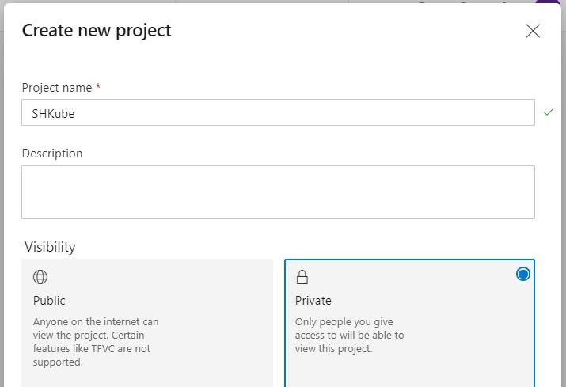
</p>

Go and create a new pipeline
<p align="center">
  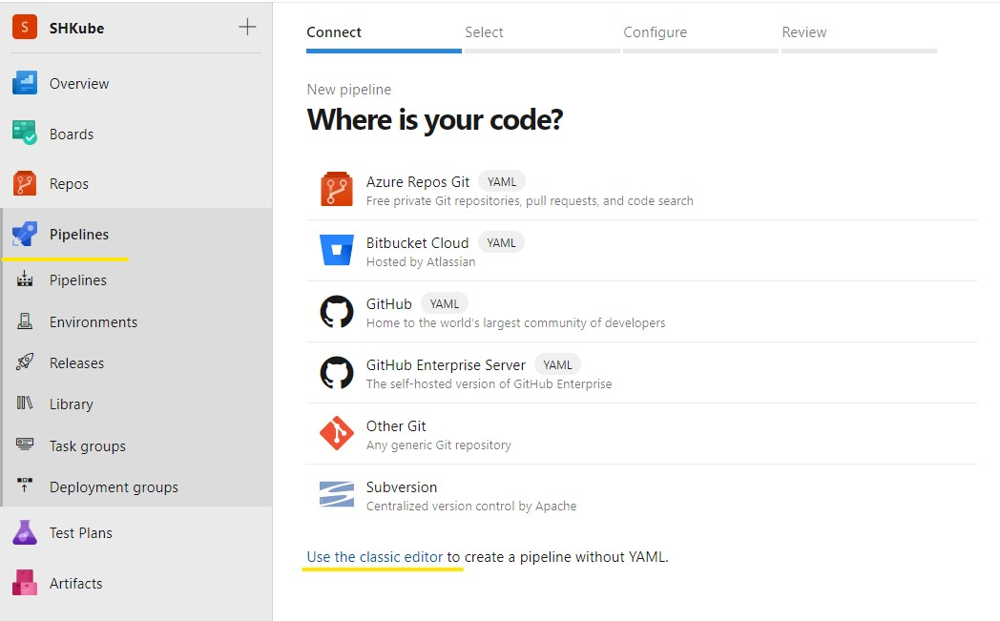
</p>

I'm going to use classic editor and select github repository so pick your repository 
and a branch which you are going to use to build a container from
<p align="center">
  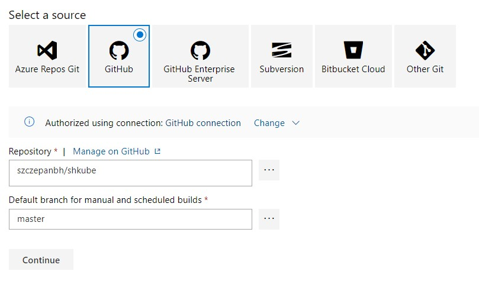
</p>

If you see Docker Compose on a list you can use it but I will pick Empty job
<p align="center">
  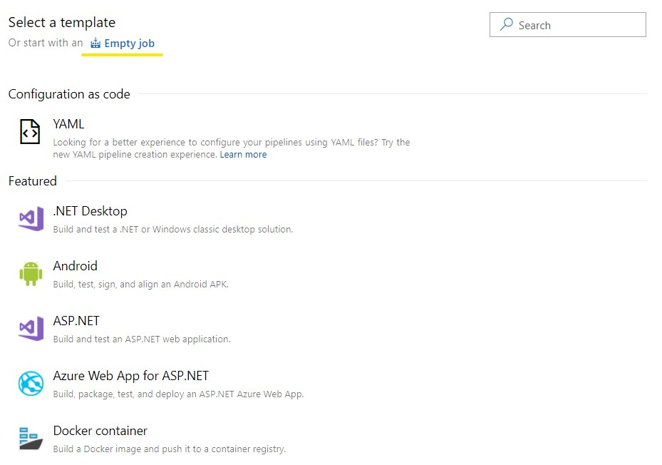
</p>

Use `+` button to add first step of your pipeline! In this step we will build a new docker image with your application.
We will use Docker Compose step to consume your `docker-compose.yml` file.
 <p align="center">
  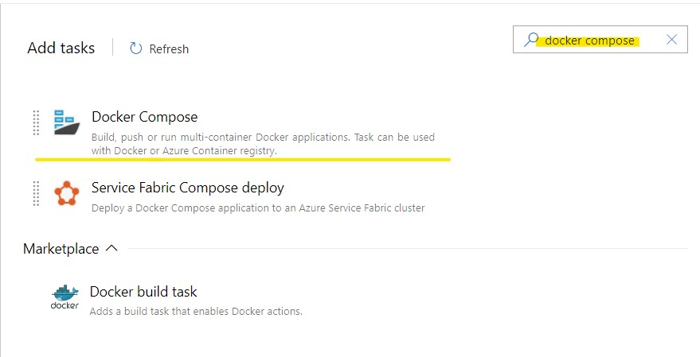
</p>

Now there are few things to do:
* select your Azure Subscription
* select Azure Container Register
* put a path to your `docker-compose.yml` file
* change Action to `Build service image`
* and put `$(Build.BuildId)` as Additional Image Tags
 <p align="center">
  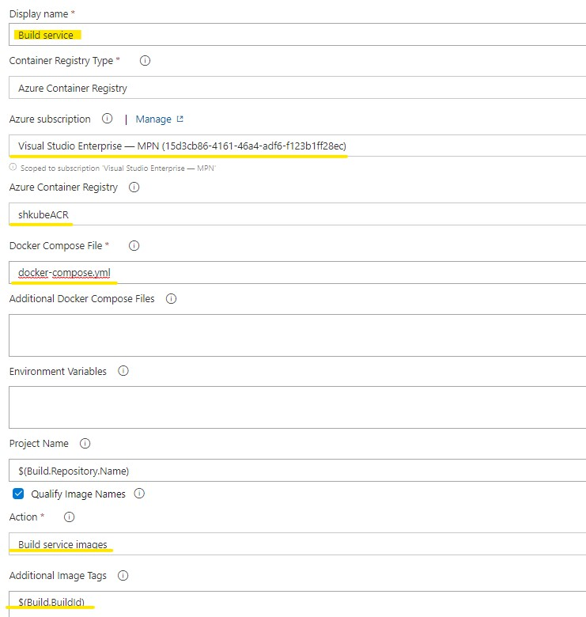
</p>

Great! Now we have to push this image to our ACR. Lets add second Docker Compose step.
The only difference is the Action field. Now pick `Push image service`
<p align="center">
  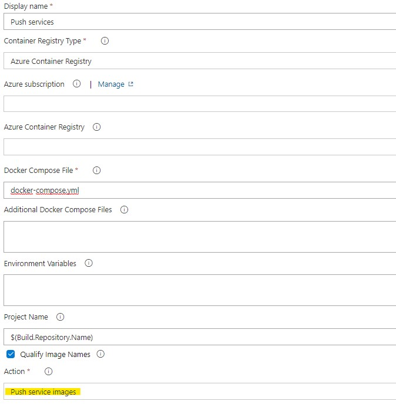
</p>

The third step is optional but recommended. Locking an image version or a repository so that it can't be deleted or updated.
As before add Docker Compose step. The only difference is the Action field. Now pick `Lock image service`.
Output docker compose file will be filled automaticly.
<p align="center">
  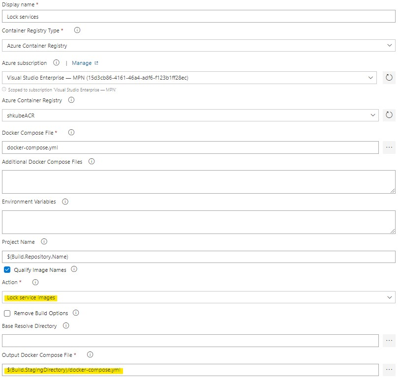
</p>

There ate two more steps to add. 

Add Copy Files step.
* In Contents put a name or path to your `deployment.yml` file (we will use this file during Release)
* In Target folder put `$(Build.ArtifactStagingDirectory)`
<p align="center">
  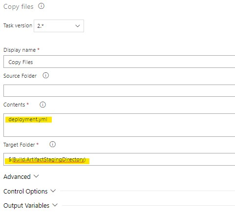
</p>

And Publish build artifacts step. Leave it as is.
<p align="center">
  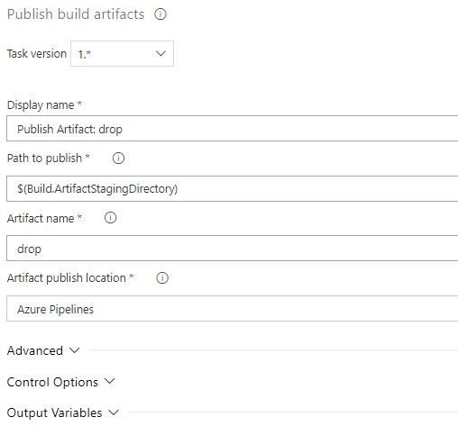
</p>

We will use `Artifact name` during Release
If you want your pipeline to trigger automaticly after each merge to selected branch go to Triggers tab and select Enable continuous integration
<p align="center">
  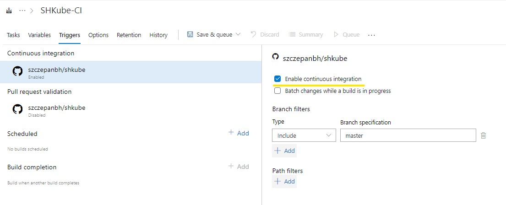
</p>

Click on Build pipeline and change Agent Specification
<p align="center">
  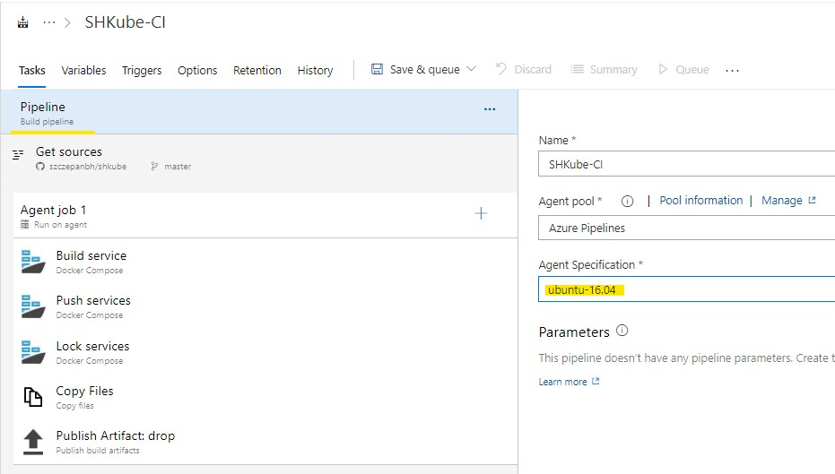
</p>

Now we can test our pipeline! Hit Save & queue.
<p align="center">
  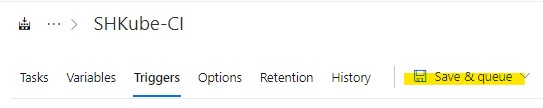
</p>
